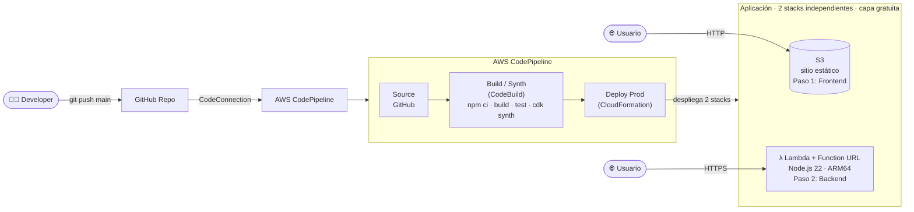

# CI/CD cloud-native: acelerando entregas con AWS 🚀

Demo en vivo para **AWS UG Piura**. Desplegamos un pequeño proyecto en
**TypeScript** usando únicamente servicios **serverless de costo ~0**, y todo el
CI/CD se define como código con **AWS CDK**.

Cada `git push` a la rama `main` en GitHub dispara automáticamente un
**AWS CodePipeline** que compila, prueba y despliega la aplicación.

> 🧭 **¿Solo quieres desplegar?** Salta a [🚀 Despliegue paso a paso](#-despliegue-paso-a-paso).

---

## 🏗️ Arquitectura



> **Frontend y backend son independientes.** El sitio en S3 es estático y
> autónomo (no llama al backend), y la Lambda se abre por su Function URL. Así
> cada uno se despliega como un paso separado, sin acoplamiento.

**Servicios usados (todos serverless):**

| Servicio | Rol en la demo | Costo |
|---|---|---|
| **GitHub + CodeConnection** | Origen del código; dispara el pipeline | $0 |
| **AWS CodePipeline** | Orquesta source → build → deploy | $0 (1ra pipeline V1 gratis/mes) |
| **AWS CodeBuild** | Ejecuta `npm ci/build/test/cdk synth` | $0 (100 min/mes gratis) |
| **AWS CloudFormation** | Aplica los cambios de infraestructura | $0 |
| **Amazon S3** | Hospeda el frontend (static website) + artefactos | $0 / centavos |
| **AWS Lambda** | Backend (handler en TypeScript) | $0 (1M req/mes gratis) |
| **Lambda Function URL** | Expone la Lambda por HTTPS | $0 (sin API Gateway) |
| **CloudWatch Logs** | Logs con retención de 7 días | centavos |

> 💡 La pieza clave es **CDK Pipelines** (`aws-cdk-lib/pipelines`): con ~30 líneas
> describimos un CodePipeline que usa CodeBuild por debajo. No escribimos
> buildspecs ni configuramos webhooks a mano.

---

## 📂 Estructura del proyecto

El repo separa la **infraestructura** (`infra/`) de la **aplicación** (`app/`),
pero mantiene un solo `package.json` para que el pipeline sea simple:

```
CICD101/
├── infra/                     # 🏗️  INFRAESTRUCTURA (CDK)
│   ├── bin/
│   │   └── app.ts             # Entry point del CDK app
│   ├── lib/
│   │   ├── pipeline-stack.ts      # El pipeline (CodePipeline + CodeBuild)
│   │   ├── application-stage.ts   # Agrupa los 2 stacks de la app
│   │   ├── frontend-stack.ts      # Paso 1: sitio estático en S3
│   │   └── backend-stack.ts       # Paso 2: Lambda + Function URL
│   └── test/
│       └── application.test.ts    # Tests de infraestructura
│
├── app/                       # 📦  APLICACIÓN (lo que se despliega)
│   ├── backend/
│   │   └── handler.ts         # Lambda en TypeScript
│   └── frontend/              # Sitio estático (autónomo)
│       ├── index.html
│       ├── styles.css
│       └── app.js             # Solo muestra la hora de carga
│
├── cdk.json                   # app: infra/bin/app.ts
├── package.json               # único (raíz): npm ci · build · test · cdk synth
├── tsconfig.json
└── .env                       # config local (no versionado)
```

**Separación importante:**
- `infra/` → todo el **CI/CD** y la definición de recursos. `pipeline-stack.ts`
  se despliega 1 sola vez a mano; el resto lo aplica el pipeline.
- `app/` → el **código que se despliega** (backend + frontend). Sin dependencias
  propias: la Lambda la empaqueta CDK con esbuild y el frontend es estático.
- El frontend y el backend son **dos stacks independientes** (`Prod-Frontend` y
  `Prod-Backend`), así el pipeline los despliega como **dos pasos separados**.
- `app/frontend/` se sube a S3 con `BucketDeployment` (sitio estático, sin
  CloudFront para mantenerlo simple).

---

## 🚀 Despliegue paso a paso

> Sigue los pasos en orden. Del **Paso 1 al 6** es una configuración que se hace
> **una sola vez**; de ahí en adelante cada `git push` despliega solo.

### Paso 1 — Prerrequisitos

1. Cuenta de AWS y **AWS CLI** configurado (`aws configure` / SSO).
2. **Node.js 18+** y **npm**.
3. **CDK Toolkit**: `npm install -g aws-cdk` (o usa `npx cdk`).
4. Repo en **GitHub** con este código, y una **CodeConnection** ya creada y en
   estado *Available* (el usuario indicó que ya la tiene habilitada ✔️).

### Paso 2 — Obtener el ARN de tu CodeConnection

Consola → **Developer Tools → Settings → Connections**, o por CLI:

```bash
aws codeconnections list-connections \
  --query "Connections[].{Name:ConnectionName,Status:ConnectionStatus,Arn:ConnectionArn}" \
  --output table
```

Copia el ARN, se ve así:
`arn:aws:codeconnections:us-east-1:111122223333:connection/xxxxxxxx-xxxx-...`

### Paso 3 — Configurar variables (`.env`)

Los valores sensibles/variables se leen desde un archivo **`.env`** (no
versionado; está en `.gitignore`). Copia la plantilla y complétala:

```bash
cp .env.example .env
```

```ini
# .env
GITHUB_REPO=TU_USUARIO/CICD101
GITHUB_BRANCH=main
CODESTAR_CONNECTION_ARN=arn:aws:codeconnections:us-east-1:111122223333:connection/xxxxxxxx
```

`infra/bin/app.ts` carga el `.env` automáticamente con `dotenv`. (Si prefieres,
puedes seguir pasando los mismos valores por contexto: `-c connectionArn=...`;
las variables de entorno tienen prioridad.)

#### 👤 Usar un perfil de AWS (opcional)

El perfil solo se usa en el **bootstrap/deploy manual desde tu máquina** (el
pipeline corre en CodeBuild con su propio rol IAM). El perfil lo consume el
**CLI de CDK**, no `app.ts`, por eso los scripts `npm run bootstrap|deploy|destroy`
usan `dotenv-cli` para inyectar las variables del `.env` al proceso del CLI.

Descomenta en tu `.env`:

```ini
AWS_PROFILE=mi-perfil
AWS_REGION=us-east-1
```

Alternativa sin `.env` (equivalente): pasa el flag o exporta la variable.

```bash
npx cdk deploy --profile mi-perfil
# o
export AWS_PROFILE=mi-perfil && npx cdk deploy
```

### Paso 4 — Instalar dependencias y probar localmente

```bash
npm install
npm run build
npm test
```

### Paso 5 — Bootstrap del entorno CDK

Solo la 1ra vez por cuenta/región. Usa el perfil/región del `.env` gracias a
`dotenv-cli`:

```bash
npm run bootstrap
```

> 🩹 Si al desplegar el frontend ves un error del custom resource del tipo
> `aws s3 cp ... returned non-zero exit status 1`, casi siempre es un **bootstrap
> viejo** (al `BucketDeployment` le falta permiso sobre el bucket de assets).
> Vuelve a correr `npm run bootstrap` (es idempotente) y re-dispara el pipeline.

### Paso 6 — Desplegar el pipeline

Despliega **el pipeline** (no la app: el pipeline desplegará la app). Todo sale
del `.env`: repo, connection ARN y perfil de AWS:

```bash
npm run deploy
```

> A partir de aquí **ya no vuelves a hacer `deploy` a mano** para cambios de la
> app: cada `git push` a `main` dispara el pipeline y despliega `app/` solo.
> (Solo si cambias la *definición del pipeline* vuelves a correr `npm run deploy`.)

### Paso 7 — Verificar el despliegue

Ve a la consola de **CodePipeline** y observa cómo corre:
`Source → Build → Deploy`. El paso Deploy despliega **dos stacks** (Frontend y
Backend). En sus outputs de CloudFormation encontrarás:

- `Prod-Frontend` → **FrontendUrl** → el sitio en S3 (esto abres en el navegador).
- `Prod-Backend` → **BackendFunctionUrl** → la API (Lambda), si quieres probarla aparte.

---

## 🧪 Comandos útiles

| Comando | Qué hace |
|---|---|
| `npm run build` | Compila TypeScript |
| `npm test` | Corre los tests de infraestructura (Jest) |
| `npm run synth` | Genera el CloudFormation localmente |
| `npm run diff` | Muestra qué cambiaría |
| `npm run bootstrap` | Bootstrap del entorno CDK |
| `npm run deploy` | Despliega el pipeline |
| `npm run destroy -- <stack>` | Elimina un stack |

(Todos toman la config del `.env` —incluido `AWS_PROFILE`— vía `dotenv-cli`; no
necesitas flags `-c` ni `--profile`. Para pasar flags extra usa `--`, p. ej.
`npm run deploy -- --require-approval never`.)

---

## 💸 Notas de costo

- **CodePipeline V1**: la primera pipeline *activa* por cuenta/mes es **gratis**;
  por eso dejamos el tipo V1 por defecto (el warning de synth es informativo).
- **CodeBuild**: 100 min/mes gratis en `general1.small` (Linux). La demo usa
  muy pocos minutos por ejecución.
- **Lambda + Function URL**: dentro de la capa gratuita permanente.
- El único costo residual son centavos de **S3** (artefactos) y **CloudWatch
  Logs**, que limpiamos con el `destroy`.

---

## 🧹 Limpieza

```bash
# Borra los dos stacks de la app (usa el perfil del .env)
npm run destroy -- Prod-Frontend Prod-Backend

# Borra el pipeline
npm run destroy -- CICD101-Pipeline
```

Luego, opcionalmente, vacía/borra el bucket de artefactos del pipeline y el
bucket de assets del bootstrap (`cdk-hnb659fds-...`) si ya no los necesitas.
